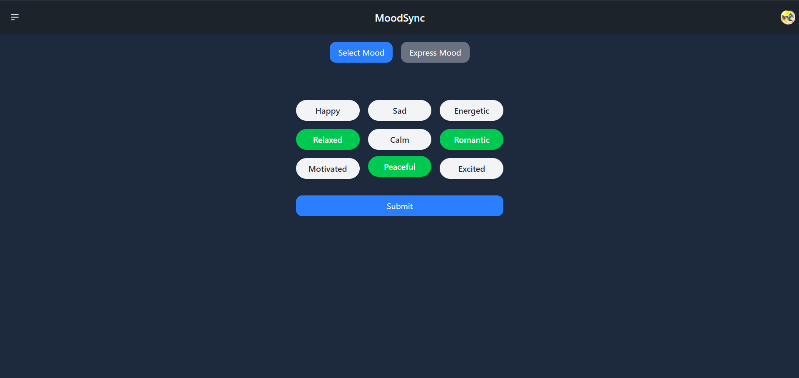
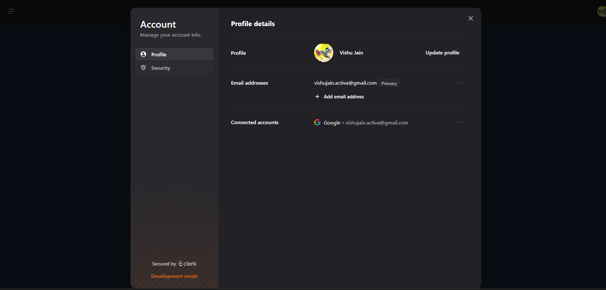
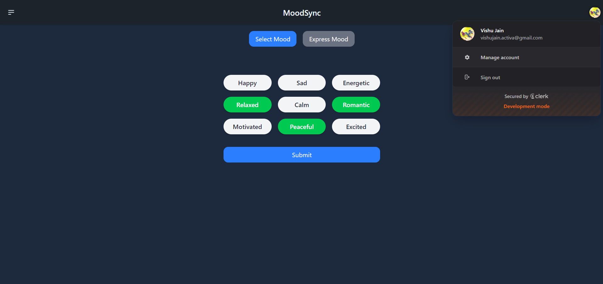

# MoodSync

MoodSync is a zone where you can come and express your feelings and it will understand it and suggest you the playlist that suits your mood.

## Table of Contents

- [Features](#features)
- [Technologies](#technologies)
- [Sample Images](#sampleImages)
- [Demo](#demo)

## Features
- **User Authentication:** Secure sign-in/sign-up using [Clerk.dev](https://clerk.dev/).  
- **Mood Selection:** Select multiple moods or express feelings naturally.  
- **AI Playlist Generation:** Curated playlists based on mood and preference.
- **AI Playlist Generation:** Curated playlists based on mood and preference.  
- **Responsive UI:** Built with React and Tailwind CSS and DaisyUI.  

## Technologies
- **Frontend:** React, Tailwind CSS, DaisyUI 
- **Backend:** Node.js, Express.js  
- **Database:** MongoDB  
- **Authentication:** Clerk.dev  
- **APIs:** Spotify API, Gemini AI (for mood interpretation)  
## Samples Images

<video src="gallery/demo.mp4" controls width="600"></video>
## Demo

<!-- Check out the live site here: [YelpCamp Live]( https://yelp-camp-o73i.onrender.com/) -->
